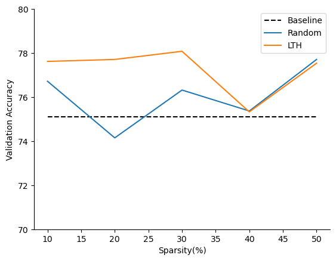
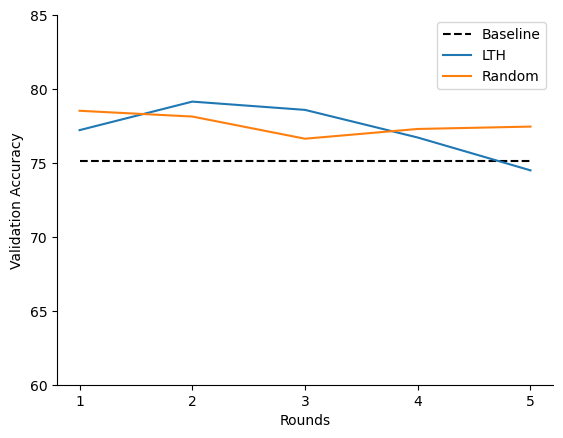
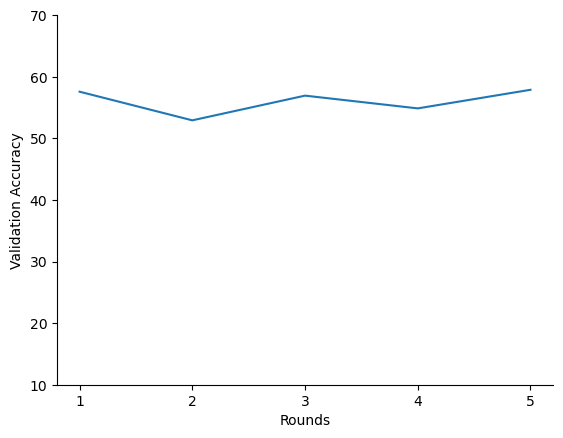

# Lottery-Ticket-Hypothesis
What is this hypothesis : The lottery ticket hypothesis is a theory in the field of deep learning that suggests that neural networks contain a sparse subnetwork, which can be trained to achieve comparable or even better performance than the original dense network.
This subnetwork is known as the "winning ticket" or "lottery ticket." The hypothesis suggests that these winning tickets can be found by pruning the weights of the original network, and then training the remaining weights from their original initialization.
The idea behind the lottery ticket hypothesis is that neural networks contain more parameters than they actually need to achieve their performance, and that by removing some of these parameters, the network becomes more efficient and easier to train.

Results of performing Lottery Ticket Style of training on a Convolutional Neural Network :

Reference : The Lottery Ticket Hypothesis: Finding Sparse, Trainable Neural Networks 
Neural network pruning techniques can reduce the parameter counts of trained networks by over 90%, decreasing storage requirements and improving computational performance of inference without compromising accuracy. However, contemporary experience is that the sparse architectures produced by pruning are difficult to train from the start, which would similarly improve training performance.
(https://arxiv.org/pdf/1803.03635.pdf)
